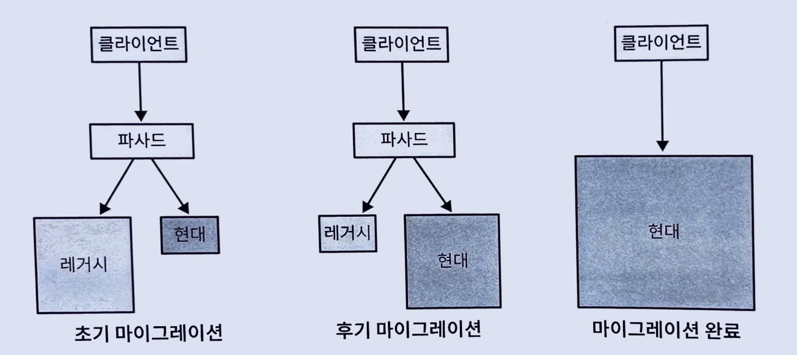
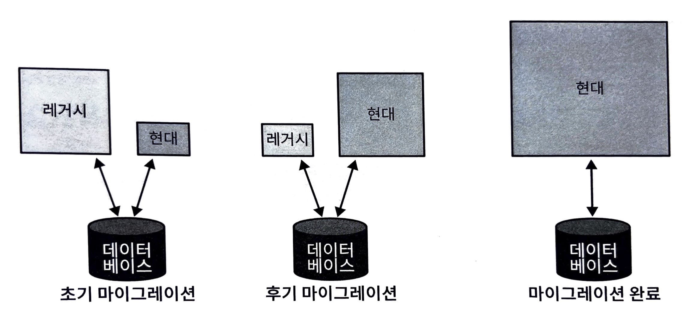

# 13. 실무에서의 도메인 주도 설계
* [그린필드 프로젝트](https://en.wikipedia.org/wiki/Greenfield_project)
  * 레거시를 고려하지 않아도 되는 새로운 환경에서 시작하는 프로젝트 
* [브라운필드 프로젝트](https://en.wikipedia.org/wiki/Brownfield_(software_development))
  * 레거시를 고려하고 공존해야 하는 프로젝트
   

* DDD는 그린필드 프로젝트에만 적용할 수 있다? 
  * 그렇지 않다
  

* DDD의 모든 패턴을 실무에 적용해야 한다?
  * 그렇지 않다

    
### 현대화 전략
* 레거시 시스템을 처음부터 다시 작성하는 일은 쉽지 않으며, 경영진이 이러한 변신을 지원하는 경우도 드묾
  

* 크게 생각하되 작게 시작
  * 현대화의 관점에서 어디에 투자할지 전략적인 결정이 필요
* 기술적 구현 패턴이 아닌 하위 도메인 경계를 반영해 바운디드 컨텍스트 재구성
    * 기존의 마케팅 바운디드 컨텍스트
      * 애플리케이션
      * 인프라스트럭처
      * 모델
      * 모바일
      * 서비스
      * UI
    * 재구성한 마케팅 바운디드 컨텍스트
      * 광고소재
      * 캠패인
      * 최적화
      * 퍼블리싱
* 바운디드 컨텍스트 재구성은 비교적 안전한 형태의 리팩터링 방식
  * 라이브러리 동적 로딩, 리플렉션과 같은 기존의 참조가 끊어지지 않아야 함
  

* 여러 팀이 동일한 코드베이스에서 작업?
  * 각 팀에 대한 바운디드 컨텍스트 정의
* 서로 다른 컴포넌트에서 충돌하는 모델 존재?
  * 충돌하는 모델을 별도의 바운디드 컨텍스트로 재배치
  
  
* 복잡성에 부합하지 않는 패턴을 구현하는 핵심 하위 도메인을 찾아라
  * 비즈니스의 성공에 직접적인 영향을 미치는 컴포넌트는 자주 변경되는데, 이부분의 설계가 좋지 않을 경우 유지보수와 개선이 어려움
   

* 작은 점진적인 개선이 중요
  * 처음부터 완벽하게 DDD를 도입하지 말고, 기술로 결정하는 것이 아닌 비즈니스에 좌우됨을 인지
  * 비즈니스 로직 수집
  * 애그리게이트 설계
  * 밸류 오브젝트 찾기
  * 트랜잭션 경계 분석
  * 솔루션이 강한 일관성을 보장해야 하는지 확인하기

* [스트랭글러 패턴](https://learn.microsoft.com/ko-kr/azure/architecture/patterns/strangler-fig)
  * 스트랭글러 무화가는 숙주 나무(다른 나무)의 가지에서 자라기 시작해 토양에 부리를 내리고 숙주 나무를 죽게 만듦
  * 스트랭글러 패턴을 레거시시스템 개선에 적용해보자
    * 스트랭글러 패턴은 [파사드 패턴](https://en.wikipedia.org/wiki/Facade_pattern) 패턴과 함께 사용됨
  
  

### 실용적인 도메인 주도 설계
* 도메인 주도 설계는 애그리게이트나 밸류 오브젝트에 관한 것이 아니라, 비즈니스 도메인이 소프트웨어 설계 의사결정을 주도하는 것

